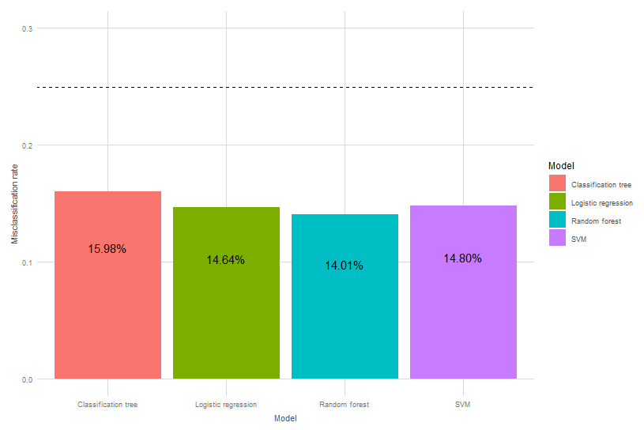
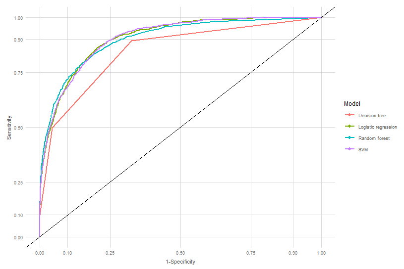

A comparison of ML classification methods
================

Summary
-------

This project investigates the performance of four machine learning algorithms on the [UCI ML Repository](https://archive.ics.uci.edu/ml/datasets/Adult) data set `adult`. Classifying the binary *income* variable {&lt;= 50k, &gt;50k} is the focus. The four algorithms tested are classification tree, random forest and logistic regression and SVM. Some common performance key values such as misclassification rate, sensitivity and specificity are calculated. Moreover, ROC curves are looked at to investigate optimal cut-offs.

